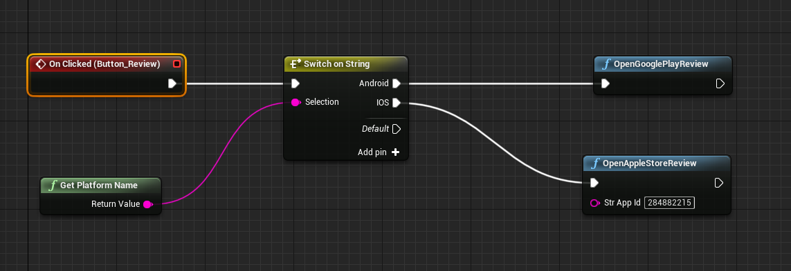

# AppReview
this is a UE5 plugin for App review.

# Get Start
this plugin only have two function, one for android and the other for ios, user can wrapper in one blueprint function.

to open your game in google play for review, you need the package name.
to open your game in apple store for review, you need your app store id.

# Example project
here is the [example project](), u can build and install on your phone,
when u click the button, it will open google play and apple store to review.
