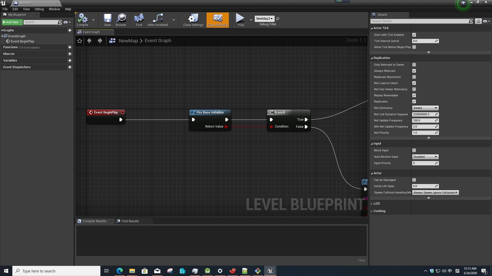
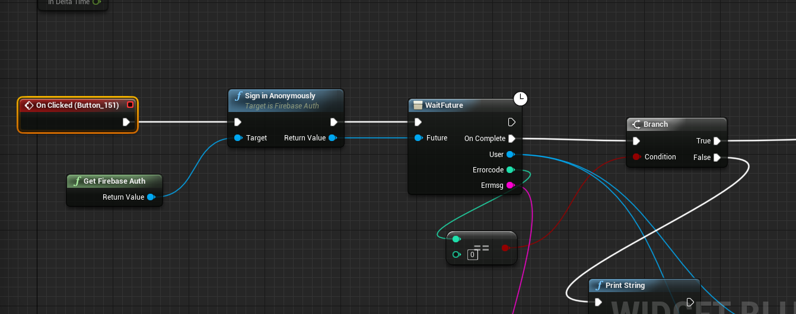
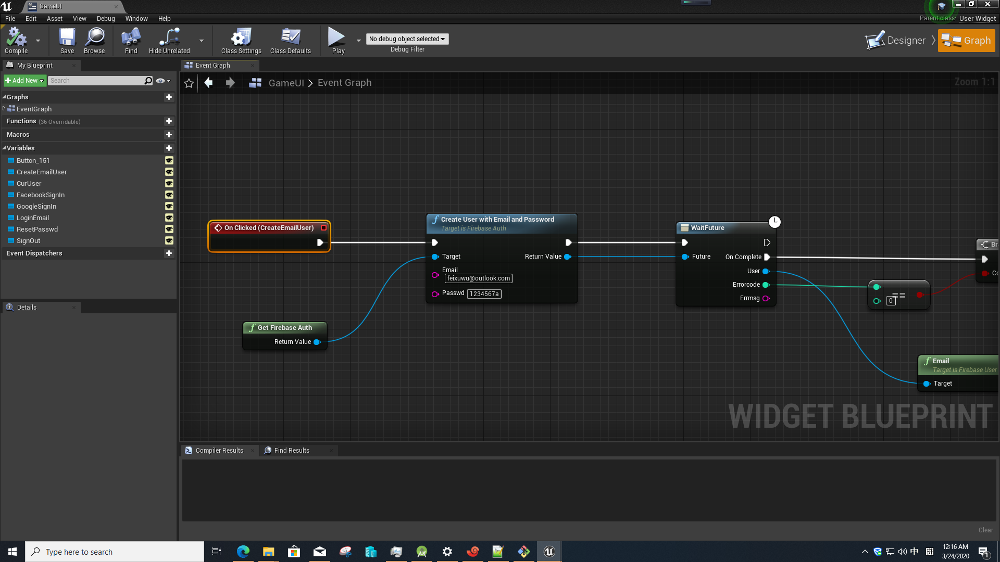
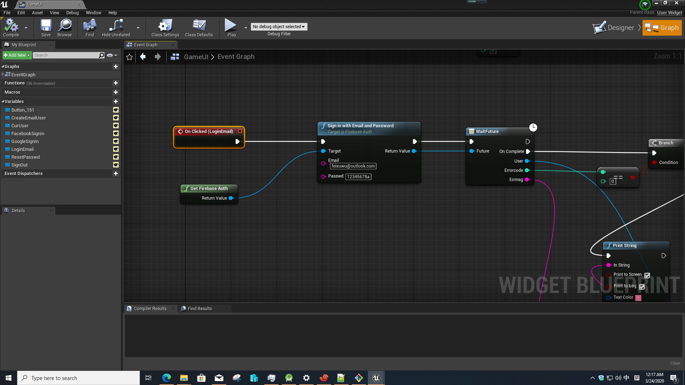
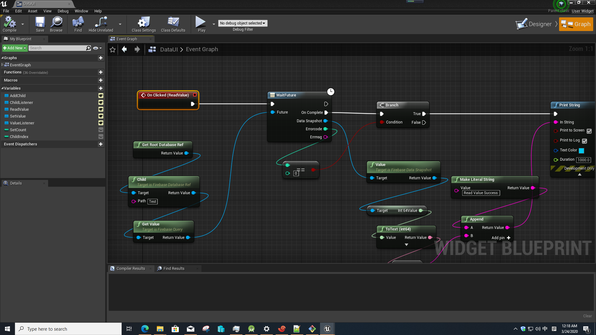

# EasyFirebase
this is a firebase basic plugin for unreal engine 4 mobile developer, both c++ and blueprint supported.

# Get Start

 ## Initlize
 befor use this plugin, u need first initlize firebase in level begineplay
 

 ## anonymously login
 for guest user, we can use anonymously login:
 

 ## email login
 register email user with password:
 
 
 login with email and password:
 

 ## set value
 set value to firebase realtime database:
  

 ## get value
 get value from firebase realtime database:
  

# firebase auth tutorial:

# firebase realtime database tutorial:

# FAQ
## why my valueListener/ChildLister stop working after some time?
 the reason is your databaseref GC by the system, so to avoid this, u need save the databaseref node to a variable,
 after save as a variable, the databaseref node will not GC by system, then the valueListener/ChildListener will works as u expect.
 
## I bought EasyAds Pro and EasyFirebase Pro both, and use this two plugin in one project, android package success, but ios package fail, how to fix it?
  this is a problem of plugin conflict in ios, since this two plugin use part of same framework, so to fix it, need to change UBT code.
  I build 4.24 and 4.25 UBT and upload to google drive, to fix the plugin conflict in ios, download the zip file and unzip it, put the UBT replace the UBT in engine,
### 4.24:
 1.[UBT 4.24](https://drive.google.com/file/d/1hA12ZzBzJJgKZZNspeYTZplanKomNz6_/view?usp=sharing)
 download and unzip, put the UnrealBuildTool.exe to 
 UE_4.24\Engine\Binaries\DotNET\
 
 2.package for ios again,then it will success.

### 4.25:
1.[UBT 4.25](https://drive.google.com/file/d/1wxWlS-UcAxG03EqC1vPzsjUszov8iCJY/view?usp=sharing)
download and unzip, put the UnrealBuildTool.exe to 
UE_4.25\Engine\Binaries\DotNET\

2.package for ios again,then it will success.

  

