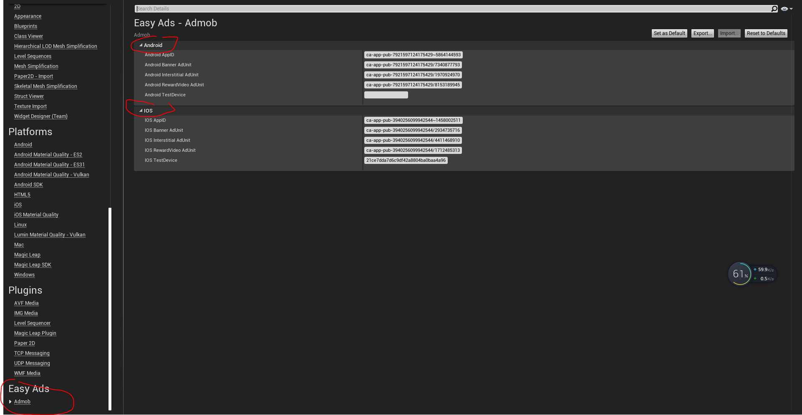
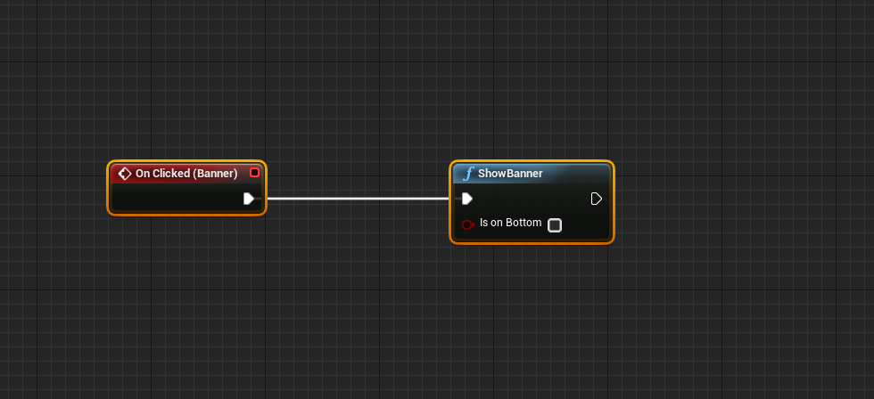
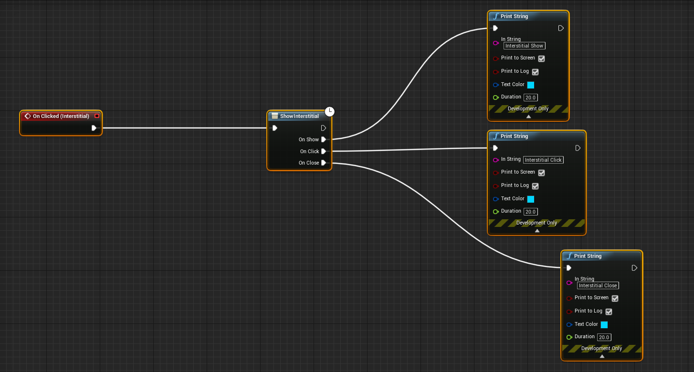
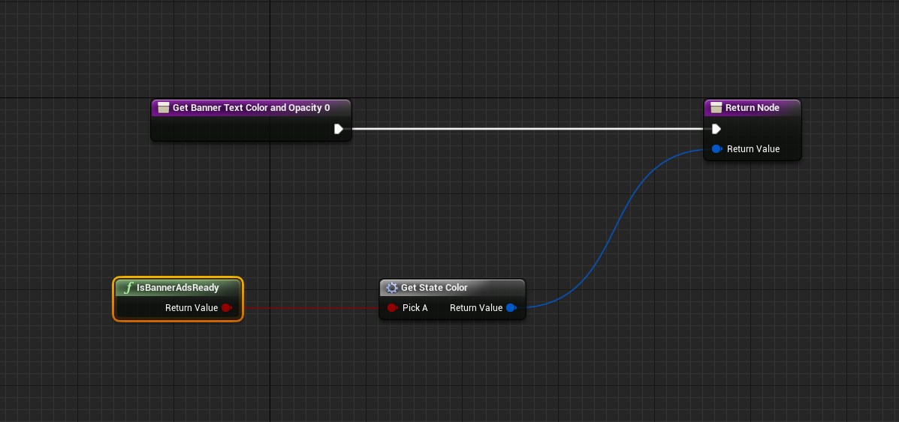
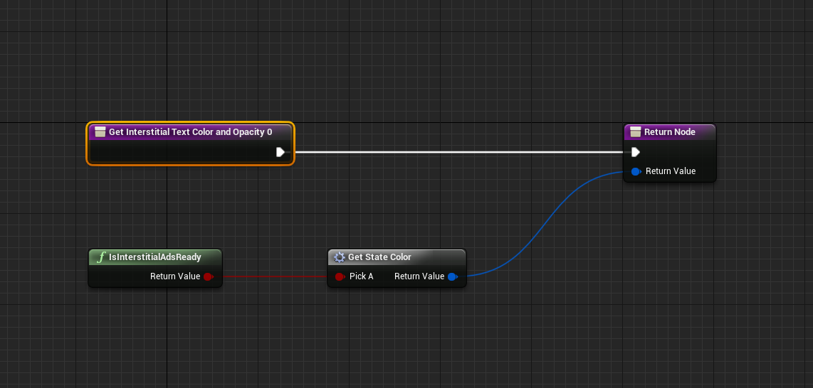
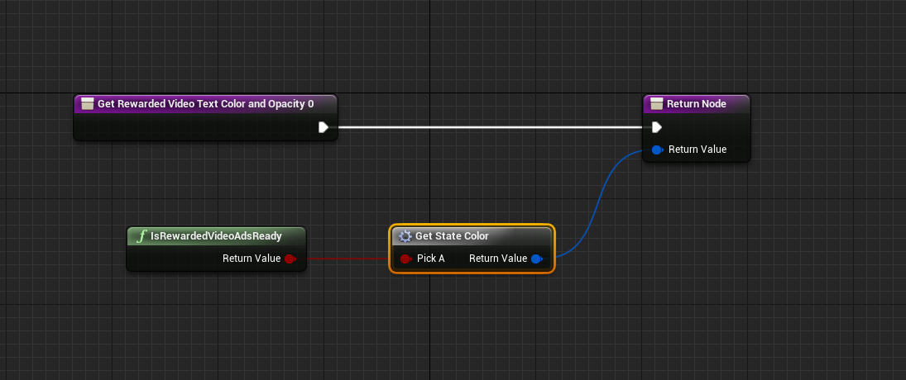
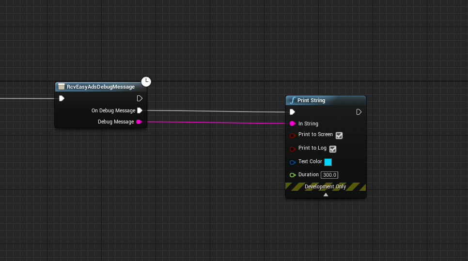

# Document

This plugin help you easy integrates multiple ad networks(admob, unity(4.23 or newer), vungle(4.23 or newer), chartboost(4.23 or newer)) for your game both Android and IOS same code,
All features are available in C++ and Blueprint. this plugin automatic process ads reload and other detail, so
 you can easy use just call when you need.
 
 Contact:feixuwu@outlook.com
 
 
 # AdNetworks
 Admob
 
 Unity(4.23 or new version)
 
 ChartBoost(4.23 or new version)
 
 Vungle(4.23 or new version)
 
 # New Feature:GDPR Support

 ## How To
 if you try to support gdpr, 
 you can only use custom load/show ads api.
 
 more detail document will need some time, here is the example project:
 https://1drv.ms/u/s!AvGg_PJlsZnwgbtBuiu3eY39fJrepA?e=1f8XNR
 
 
 # New Feature:Custom Load and Custom Show(Pro only)
  
  **I suggest all users use custom load/show api to show your ads in product. By default the plugin will automatic load your ads with adunit which you filled in project setting.
  if every time when game startup, plugin automatic load ads, but player not trigger ads show, google may think this is illegal traffic. To avoid this, you can use custom load and custom show ads api to load ads when need and show ads when need.**
  
   the EasyAds Pro allow the users to load and show ads wtih custom ad unit in code. this means you can use as many ad unit as you can,
 you are not limited can only use a single interstitial and a single rewarded video.
 here is the tutorial video:  [tutotial video](https://youtu.be/vI-uF5lHc64)
 
 # Get Start(2 step)
 
 Here is a tutorial video 
 [how to use this plugin](https://youtu.be/uoAdOpi1wCQ)
 
 ## 1. fill ad unit
   open Editor->Project Setting, find EasyAds fill the ad unit:
 
  
  
  
 ## 2. call function show ads
 in blueprint editor, when you want show show the ads, just call function "ShowBanner", "ShowInterstitial", "PlayRewardedVideo"
  ShowBanner:
  
  
  
  ShowInterstitial:
  
  
  
  PlayRewardedVideo:
  
  
  
 Some times, you want to check if ads aviable, you can call "IsBannerReady", "IsInterstiralAdsReady", "IsRewardedVideoAdsReady"
  
  IsBannerReady:
  
  
  
  IsInterstiralAdsReady:
  
   
   
  IsRewardedVideoAdsReady:
  
   
   
   ## Read debug message to learn why ads load fail:
   
   in level blueprint, on event BeginPlay call this function:
   
  
  
  from the out debug message, you can find the error number, each number describle a reason:
  
  ### 0 ERROR_CODE_INTERNAL_ERROR
  
  Something happened internally; for instance, an invalid response was received from the ad server.
  
  ### 1 ERROR_CODE_INVALID_REQUEST
  
  The ad request was invalid; for instance, the ad unit ID was incorrect.
  
  ### 2 ERROR_CODE_NETWORK_ERROR
  
  The ad request was unsuccessful due to network connectivity.
  
  ### 3 ERROR_CODE_NO_FILL
  
  The ad request was successful, but no ad was returned due to lack of ad inventory.
  
# Admob Test Ads

## Android: 

appid:ca-app-pub-3940256099942544~3347511713

banner:ca-app-pub-3940256099942544/6300978111

interstitial:ca-app-pub-3940256099942544/1033173712

rewarded video:ca-app-pub-3940256099942544/5224354917

## IOS: 

appid:ca-app-pub-3940256099942544~1458002511

banner:ca-app-pub-3940256099942544/2934735716

interstitial:ca-app-pub-3940256099942544/4411468910

rewarded video:ca-app-pub-3940256099942544/1712485313

  
