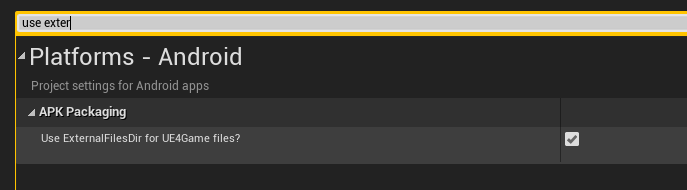

# Document

This plugin help you easy integrates multiple ad networks(admob, unity(4.23 or newer), vungle(4.23 or newer), chartboost(4.23 or newer)) for your game both Android and IOS same code,
All features are available in C++ and Blueprint. this plugin automatic process ads reload and other detail, so
 you can easy use just call when you need.
 
 Contact:feixuwu@outlook.com
 
 
 # AdNetworks
 Admob
 
 Unity(4.23 or new version)
 
 ChartBoost(4.23 or new version)
 
 Vungle(4.23 or new version)
 
 Applovin
 
 Facebook Audience
 
 # New Feature:GDPR Support

 full gdpr support, use SetConsentStatus api, you can set all ad networks support GDPR.
 more detail document will need some time, here is the [example project](https://1drv.ms/u/s!AvGg_PJlsZnwgctyzMArQcyft3k2Og?e=4MkZbc)

 
 
 # New Feature:Custom Load and Custom Show(Pro only)
  
  **I suggest all users use custom load/show api to show your ads in product. By default the plugin will automatic load your ads with adunit which you filled in project setting.
  if every time when game startup, plugin automatic load ads, but player not trigger ads show, google may think this is illegal traffic. To avoid this, you can use custom load and custom show ads api to load ads when need and show ads when need.**
  
   the EasyAds Pro allow the users to load and show ads wtih custom ad unit in code. this means you can use as many ad unit as you can,
 you are not limited can only use a single interstitial and a single rewarded video.
 here is the tutorial video:  [tutotial video](https://youtu.be/vI-uF5lHc64)
 
 # Get Start(2 step)
 
 Here is a tutorial video 
 [how to use this plugin](https://youtu.be/uoAdOpi1wCQ)
 
 ## 1. fill ad unit
   open Editor->Project Setting, find EasyAds fill the ad unit:
 
  
  
  
 ## 2. call function show ads
 in blueprint editor, when you want show show the ads, just call function "ShowBanner", "ShowInterstitial", "PlayRewardedVideo"
  ShowBanner:
  
  
  
  ShowInterstitial:
  
  
  
  PlayRewardedVideo:
  
  
  
 Some times, you want to check if ads aviable, you can call "IsBannerReady", "IsInterstiralAdsReady", "IsRewardedVideoAdsReady"
  
  IsBannerReady:
  
  
  
  IsInterstiralAdsReady:
  
   
   
  IsRewardedVideoAdsReady:
  
   
   
   ## Read debug message to learn why ads load fail:
   
   in level blueprint, on event BeginPlay call this function:
   
  
  
  from the out debug message, you can find the error number, each number describle a reason:
  
  ### 0 ERROR_CODE_INTERNAL_ERROR
  
  Something happened internally; for instance, an invalid response was received from the ad server.
  
  ### 1 ERROR_CODE_INVALID_REQUEST
  
  The ad request was invalid; for instance, the ad unit ID was incorrect.
  
  ### 2 ERROR_CODE_NETWORK_ERROR
  
  The ad request was unsuccessful due to network connectivity.
  
  ### 3 ERROR_CODE_NO_FILL
  
  The ad request was successful, but no ad was returned due to lack of ad inventory.
  
# Admob Test Ads

## Android: 

appid:ca-app-pub-3940256099942544~3347511713

banner:ca-app-pub-3940256099942544/6300978111

interstitial:ca-app-pub-3940256099942544/1033173712

rewarded video:ca-app-pub-3940256099942544/5224354917

## IOS: 

appid:ca-app-pub-3940256099942544~1458002511

banner:ca-app-pub-3940256099942544/2934735716

interstitial:ca-app-pub-3940256099942544/4411468910

rewarded video:ca-app-pub-3940256099942544/1712485313

# Release Notes

## 1.28.1(engine version >= UE5.2 support)
upgrade admob sdk and mediation sdk, android admob sdk upgrade to 22.5, ios admob sdk upgrade to 10.14.0 

## 1.25.3
remove WRITE_EXTERNAL_STORAGE from plugin.

## 1.24.0
add new ad networks: adcolony, ironsource, inmobi, tapjoy, i-mobile, and more package check help debug package error.

## 1.23.1
upgrade admob sdk to 20.6(android) and 9.4, add consent status query api:IsAdNetworkConsent

## 1.20.8
add more admob family policy api

## 1.20.5
add bitcode support for ios.

## 1.20.3
compatble with latest easyfirebase pro.

## 1.20.2(for 4.26 and 4.27)
   fix bug:in some rare case, after custom ads play finish, OnClose event not be fire.

## 1.20.1(for 4.26 and 4.27)
   remove android unused billing sdk.

## 1.20.0(for 4.26 and 4.27)
  ### sdk update
   
    admob upgrade to android 20.3 and IOS 8.9.0.
 
  ### IOS bitcode support
    
    package for ios now support bitcode.
## 1.19.0
 add admob user messaging platform to support gdpr. for compatible reason, the old consend sdk still works.
 add two new api:
 UMPRequestConsentInfoUpdate this function should be call when game startup, this function ask user consent.
 UMPResetConsentInformation this function used to reset consent information.
 
 to use user messaging platform, here is the instruction:
 ### (1).configure
 please read the section "Prerequisites" of the document https://developers.google.com/admob/ump/android/quick-start
 
 ### (2)simulate in EEA or not EEA
 please upgrade plugin to 1.19.0 or later version, open game with UE4 editor, in project setting, you can simulate EEA or not EEA.
 
 
 ### (3)ask consent in game startup
 call UMPRequestConsentInfoUpdate to ask player consent.
 
 
 
 ### (4)add an option to let player reset consent(optional)
 call UMPResetConsentInformation.
 
 
 

## 1.24.0
1.add new ad networks: adcolony, ironsource, inmobi, tapjoy, i-mobile, 
2.add more package check help debug package error.
3.support disable ad networks on ios.

## 1.23.1
upgrade admob sdk to 20.6(android) and 9.4, add consent status query api:IsAdNetworkConsent

## 1.20.8
add more admob family policy api

## 1.20.5
add bitcode support for ios.

## 1.20.3
compatble with latest easyfirebase pro.

## 1.20.2(4.26and 4.27)
fix bug: in some rare case, custom ads close callback not fire

## 1.20.1(4.26 and4.27), 1.19.3(4.25)
remove billing 2.0 from plugin.

## 1.20.0(4.26 and 4.26)
1.upgrad admob sdk to latest:android 20.3, ios:8.9.0.

## 1.9.1
fix ios package error when enable ios 14 support

## 1.19.0
support admob new "user messaging platform" for GDPR

## 1.18.10
fix Unity adapter crash problem.

## 1.18.8
automatic process conflict with OnlineSubsystemFacebook

## 1.18.7:
add ios NSUserTrackingUsageDescription localization support.

## 1.18.4
fix android upload abb error:"Your App Bundle package targets the following unknown languages: fb"

## 1.18.3
upgrade android sdk

## 1.18.2
  add new api:IsAdmobInitlized, do remember call any plugin function after IsAdmobInitlized return true, this is useful when game startup to do gdpr request(RequestConsentInfoUpdate), if admob is not initlized, call RequestConsentInfoUpdate will fail.

## 1.18.1
 ### ios 14 support
 
 to package with ios14 support, you need first copy the plugin from UE_4.2x\Engine\Plugins\Marketplace to your project,
 and uncomment //PublicDefinitions.Add("WITH_IOS14_SUPPORT=1");
 after repackage the game, when the game startup on ios14 device, it will popup a dialog to ask tracking permission.
 
 ### multiple test devices
 
 support multile test device, you can add as many test devices as you can in plugin setting.

## 1.17.3(2020/11/23)

1. full gdpr suppor, SetConsentStatus will set all ad networks consent status.

2. fix 4.24 android WRITE_EXTERNAL_STORAGE permission problem, which caused by vungle.

## FAQ
 ### (1)when I package for IOS, it have link error about XXConsent, how to fix it?
 
  #### the reason: if you use the plugin as engine plugin, for ios platform, it does not support disable ad networks. if you do want disable ad networks for ios, you need copy the plugin to your project as project plugin. 
  
  please check if u have disable some ad networks in plugin setting for ios, to fix it, there's two solutions,
  
  1.enable the disabled ad networks.
  
  2.copy the plugin to project, use it as project plugins.

 ### (2)how to fix ios package error "IOS AdditionalShippingLinkerFlags must add -rpath /usr/lib/swift, else will crash at startup"
   
   please open project setting add link flags "-rpath /usr/lib/swift"
   
   

 ### (3)how to remove WRITE_EXTERNAL_STORAGE permission?
   
   1.upgrade plugin to latest 1.25.3
   
   2.set package for distribution and enable this option:
     
