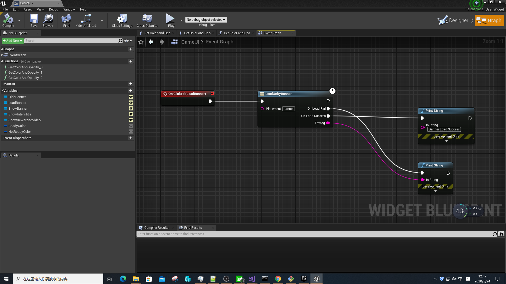
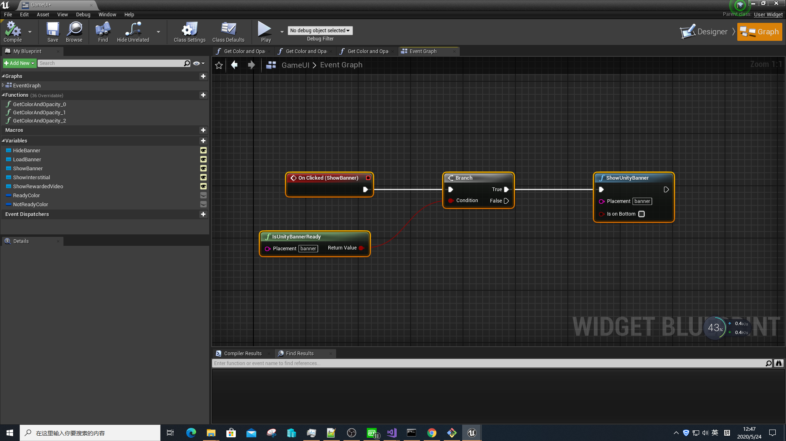
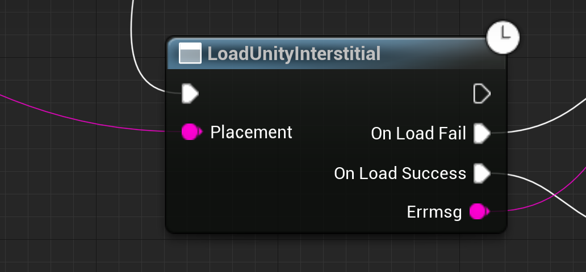
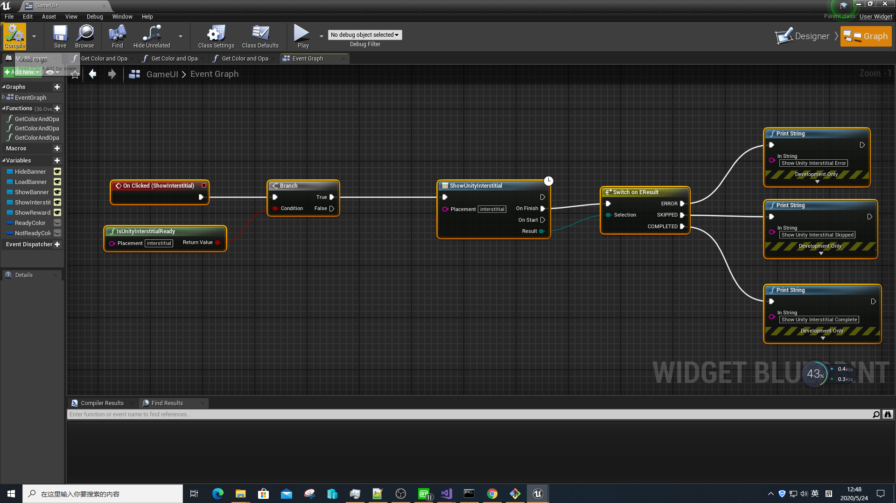
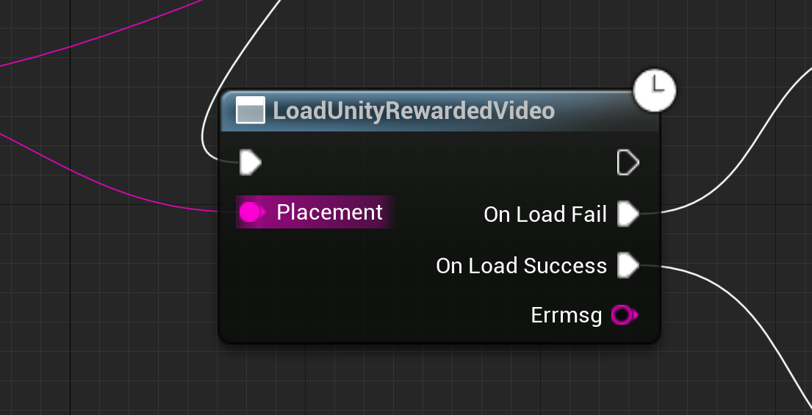
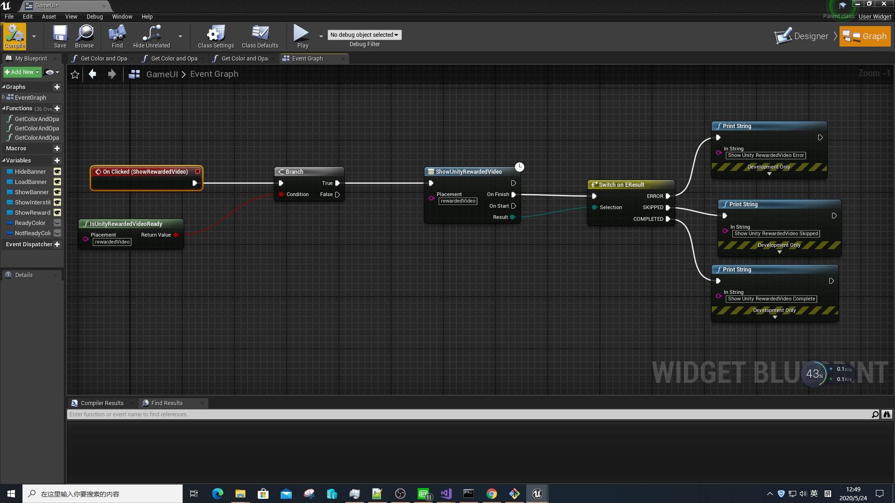

# UnityAds
Unity Ads Plugin For Unreal Engine 4.

this plugin help people show unity ads on Android and IOS. User can use blueprint load and show ads by placement.

# Supported Platform

★ 1. Android

★ 2. IOS

# Usage
★ Load Banner By Placement

   
   
★ Show Banner By Placement

   
   
★ Load Interstitial By Placement

   
   
★ Show Interstitial By Placement

   

★ Load RewardedVideo By Placement

   
   
★ Show RewardedVideo By Placement

   
   
# test ads:

##  android

appid:3032713

banner placement: banner

interstitial placement:interstitial

video:rewardedVideo

## ios
appid:3032712

banner placement: banner

interstitial placement:interstitial

video:rewardedVideo

# IOS 14 support

to package with ios14 support, you need first copy the plugin from UE_4.2x\Engine\Plugins\Marketplace to your project, and uncomment //PublicDefinitions.Add("WITH_IOS14_SUPPORT=1"); after repackage the game, when the game startup on ios14 device, it will popup a dialog to ask tracking permission.

# GDPR support

Call SetUnityConsent to set the consent state, developer can create a umg dialog to let player choose consent status.
    
   
# tutorial video:

   
