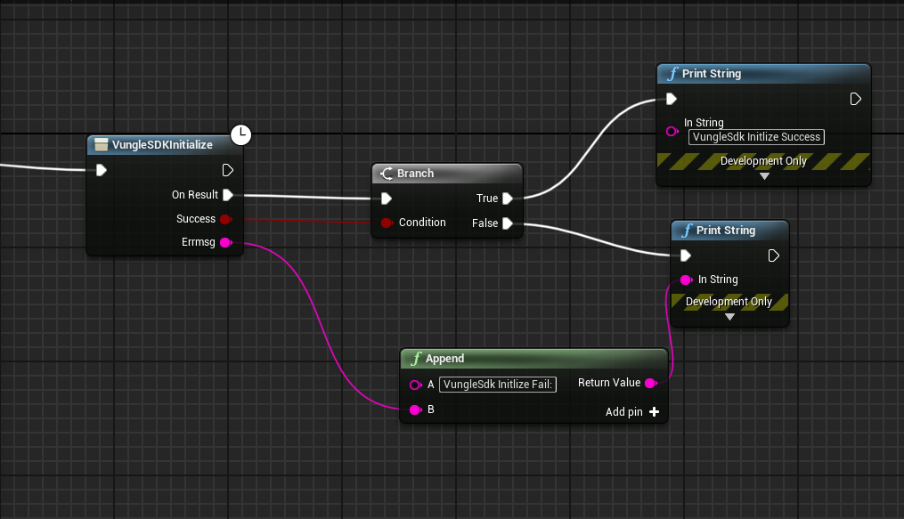
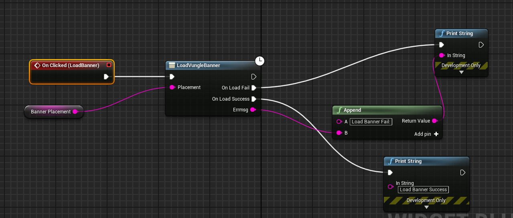
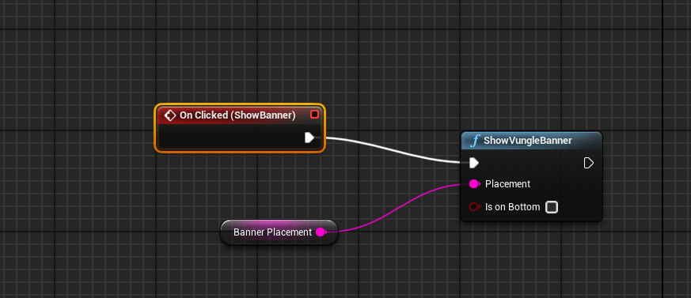
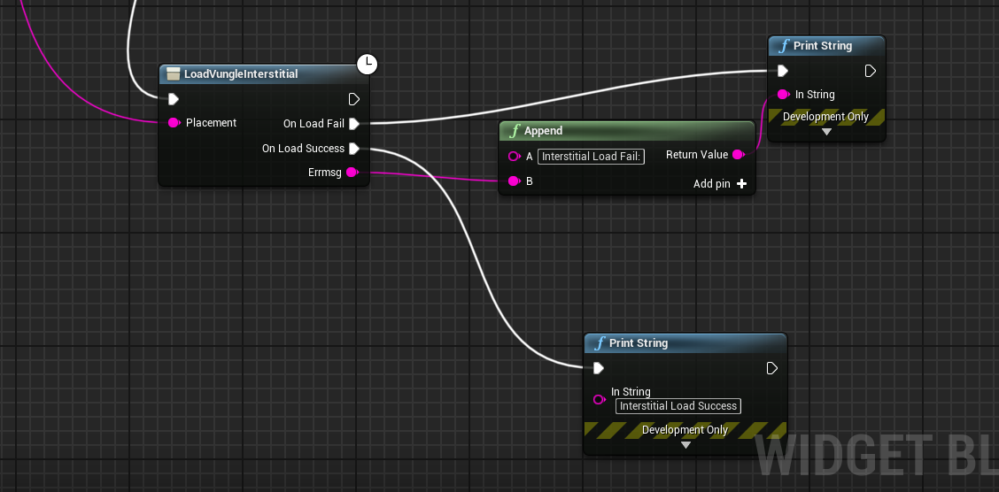
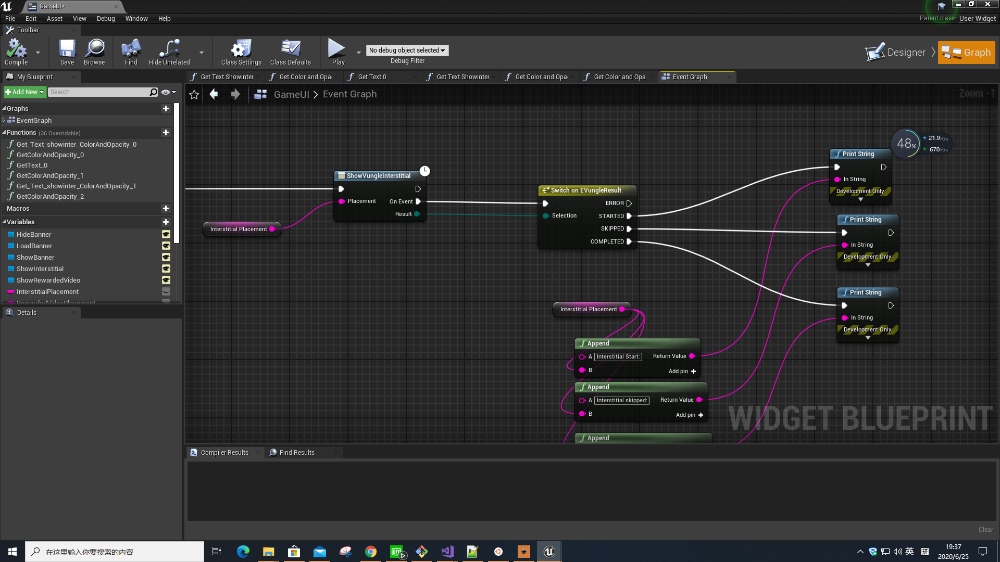
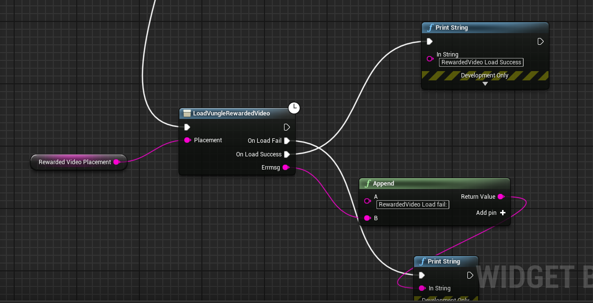
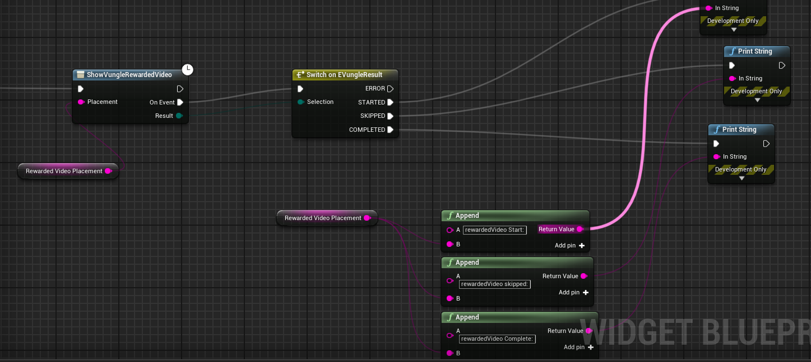

# VungleAds
Vungle Ads Plugin For Unreal Engine 4.

this plugin help people show vungle ads on Android and IOS. User can use blueprint load and show ads by placement.

# Supported Platform

★ 1. Android

★ 2. IOS

# Usage

★ Init Vungle

   

★ Load Banner By Placement

   
   
★ Show Banner By Placement

   
   
★ Load Interstitial By Placement

   
   
★ Show Interstitial By Placement

   
   
★ Load RewardedVideo By Placement

   
   
★ Show RewardedVideo By Placement

   
   
# tutorial video:

   